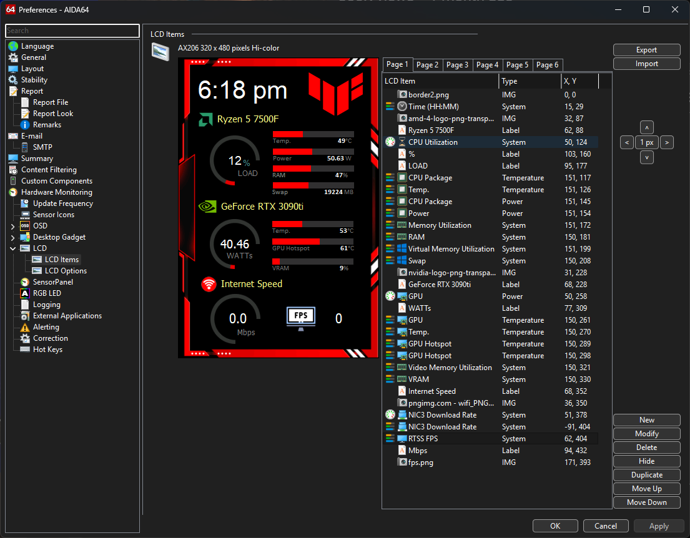

# AX206 Portrait AIDA64 Template

A portrait-oriented **AIDA64 LCD template** for **320×480 AX206 displays**.

Download the .axlcd file and import it in your AIDA64
Overtime will add more templates if i make tweeks. Try diffrent ones to your liking.

I created this because there aren't many portrait templates available for AX206 screens, and I wanted to give the community a clean starting point for their own sensor panel projects.

## Preview

## Features

- 320×480 portrait layout
- CPU utilization, temperature, and power monitoring
- GPU utilization, temperature, hotspot, and power monitoring
- RAM and swap usage
- Network speed monitoring
- FPS display
- Gaming-inspired red/black design
- Built for AX206 LCDs

## Included

- AIDA64 template

## Notes

- Designed for AX206 320×480 displays.
- Some tinkering will likely be required to match your hardware and preferred sensor configuration.
- Sensor labels and data sources may need to be reassigned depending on your CPU, GPU, motherboard, or monitoring software setup.
- All logos, icons, and decorative elements can be replaced with your own PNG files to match your build's theme.
- Feel free to move, resize, add, or remove sensors as needed.

## Why?

Most AX206 templates I found were landscape-oriented, while portrait displays seem to be largely overlooked. Hopefully this helps anyone looking for a portrait sensor panel without having to build one from scratch.

---

If you make improvements, feel free to open a pull request or share your own version with the community.
